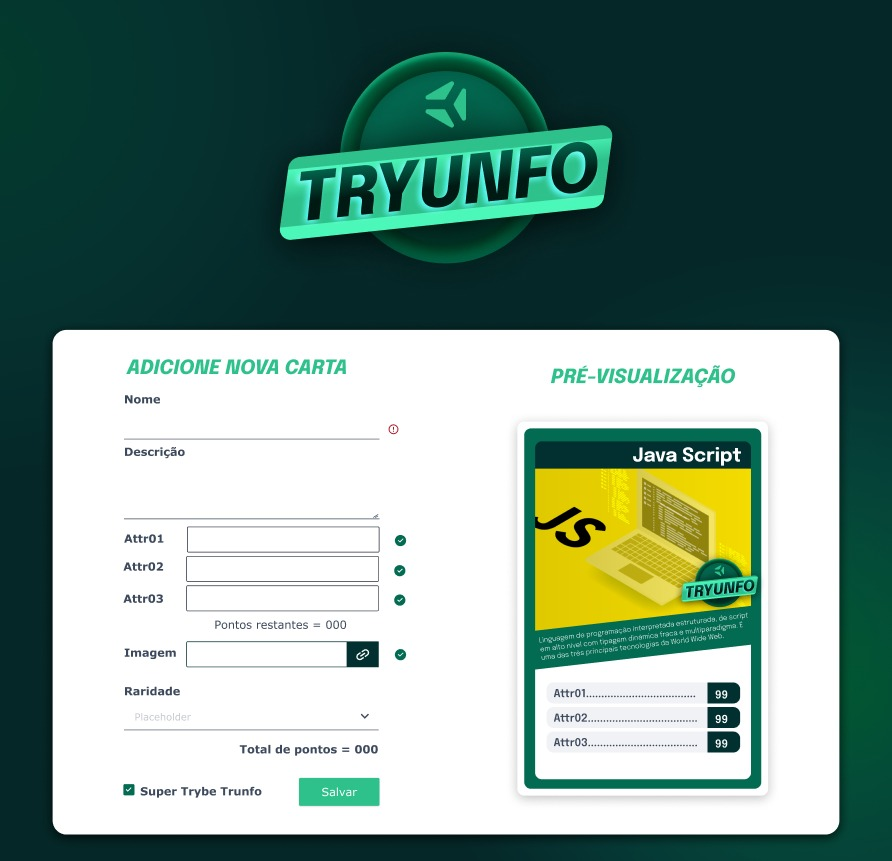

<p align="center">
  
  <br>
  <br>
  <hr />
</p>

<p align="center">
  A project developed at Trybe's Front-End Module
</p>

<br>

<p align="center">


    

</p>

## 📋 About
At this project you can create cards to build your own Top Trump deck.


<em>website mockup design</em>

## 💻 Technology
- React

## ✨ Features 
- Create your own card
- View all cards
- Filter cards by date

## 🧠 What I learned
At this project, I learned how to use states, events and forms in React.

## 📦 Running
> use Node version 14

```bash
npm i
```
```bash 
npm start
```
